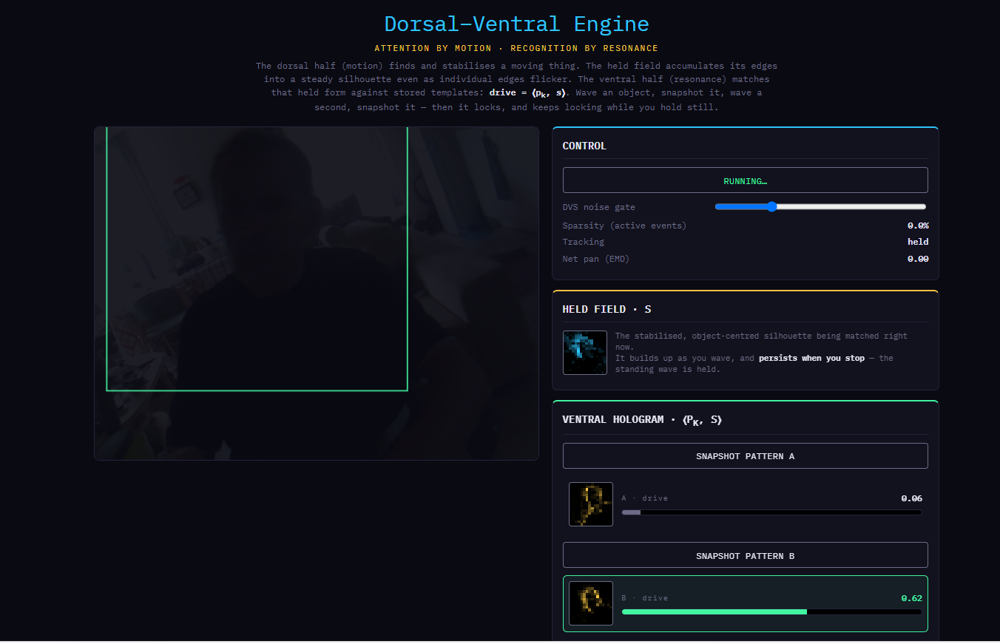

# Dorsal-Ventral Engine v2

Live at: https://anttiluode.github.io/NeuromorphicDVSplusEMDfield/

*Attention by Motion. Recognition by Resonance. A single-file, zero-training neuromorphic vision pipeline.*

**PerceptionLab / Antti Luode**

> **Do not hype. Do not lie. Just show.**

---

## What this is

This is a real-time, browser-native vision engine that mimics the primate visual system's macro-architecture without a single neural network weight. It splits the problem into two streams, using the exact primitives of the **Geometric Neuron** framework:

1.  **The Dorsal Stream (Where / Motion):** Uses a DVS-style noise gate (the delta-code) and a Hassenstein–Reichardt Elementary Motion Detector (the bilinear Koopman angular momentum, $L_k = \text{Im}(z_k \cdot z_k^*)$). It finds moving edges and groups them by common fate, generating a stabilized attention bounding box.
2.  **The Ventral Stream (What / Identity):** Uses the Model B ephaptic island readout. It accumulates those moving edges into a decaying "held field" (a standing wave, $s$). It then matches that stable silhouette against one-shot captured templates ($p_k$) using a mean-centered, unit-normalized correlation: $\text{drive} = \langle p_k, s \rangle$.

Because it relies on the delta-code (processing only what changes), it is blindingly fast, $O(K)$, and runs on a standard webcam in a browser tab.

---

## How to run it

Because modern browsers strictly block local `file:///` access from passing camera data between video elements and canvases, you must serve the directory over a local web server.

1. Clone the repository and navigate to the folder.
2. Start a local Python server: `python -m http.server 8000`
3. Open `http://localhost:8000` in your browser.
4. Allow camera permissions.

**To drive it:** Wave an object to let the green tracking box lock on and accumulate a solid silhouette in the *Held Field* window. Click "Snapshot Pattern A". Do the same with a different object for B. Now wave either object and hold it still. The corresponding island will fire and *stay* firing while you hold it.

---

## The Engineering: Why v2 Locks

Earlier attempts at this architecture failed to lock because they tried to match the *instantaneous* edge map. Waving an object differently fires a different subset of edges, resulting in zero correlation. V2 solves this through four specific interventions:

* **The Held Field ($s$):** Moving edges are accumulated with a leak (`ACCUM = 0.18`). This turns flickering, sparse motion events into a stable, object-centered silhouette. The standing wave persists even when motion stops. Store-time and match-time finally see the same geometry.
* **EMA-Smoothed Attention:** The motion centroid and radius are smoothed, stopping the bounding box from jittering and providing rough scale-normalization.
* **Mean-Centered Match:** The inner product $\langle p_k, s \rangle$ is mean-centered and unit-normalized. It yields a true correlation in $[-1, 1]$ with negative evidence, rather than an inflated overlap of "on" pixels.
* **Winner-Take-All:** The highest drive wins, provided it clears a realistic 0.50 correlation threshold.

---

## Theoretical Meaning: The Wiener-Khinchin Boundary

This engine cleanly splits the two readout types of the Geometric Neuron framework by their biological jobs:

* **Dorsal (Where/Which-Way):** Requires the *bilinear* cross-time term ($L_k$) to escape the Wiener-Khinchin ceiling and detect phase/direction.
* **Ventral (What):** Relies on the *linear*, instantaneous correlation ($\langle p_k, s \rangle$). 

Previously, the Wiener-Khinchin ceiling—the fact that linear readouts are phase-blind—was viewed as a limitation. This engine reframes it as a **design principle**. You *do not want* an identity detector to care which direction a hand swept; a hand is a hand moving left or right. Phase-blindness is the correct, necessary property for a "what" readout. The two readouts are not a good one and a crippled one; they are the two visual streams, and the WK ceiling is the principled mathematical boundary between them.

---

## The Honest Ledger

**Verified in code:**
* **Delta-Code persistence:** The recognition holds steady even when you stop moving, because the field is held. 
* **Real-world acquisition:** For the first time in this framework, patterns ($p_k$) are captured from the live world rather than hand-installed. It is one-shot memorization, sitting exactly between "built-in" and "emergent."
* **Robust Segmentation:** The bilinear EMD successfully groups sparse moving edges into a single coherent bounding box by common fate.

**The Constraints (What it is not):**
* This recognizes by *silhouette correlation*. It is tolerant to position and roughly to scale, but not to rotation or massive shape deformation. 
* This is **Model B** (the population field), not the single-cell Geometric Neuron (Model A). The ventral read here is a flat spatial correlation, not a delay-space orbit. 

**Where this points next:**
To make the geometric neuron the star, the ventral read must become an orbit. Give the stabilized silhouette a delay embedding and read its temporal trajectory. The system will stop recognizing a static pose and start recognizing a *gesture* (a wave, a grasp, a swipe). That is frequency-as-orbit doing its signature work.
